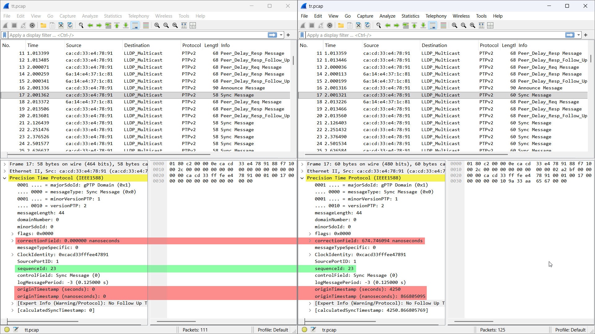

# 1588 one-step hardware timestamping

```sh
onestep-scenario <timeTransmitter> <timeReceiver>
```

```console
$ ./onestep-scenario tt tr
+ curl -LO https://github.com/richardcochran/linuxptp/raw/refs/tags/v4.2/configs/gPTP.cfg --silent
+ scp -q -O gPTP.cfg tt:
+ scp -q -O gPTP.cfg tr:
+ ssh tt tcpdump -i eth1 -w tt.pcap
+ ssh tr tcpdump -i eth1 -w tr.pcap
+ sleep 10
+ ssh tt ptp4l -f gPTP.cfg -i eth1 --twoStepFlag 0 --BMCA noop --serverOnly 1 --priority1 0 --priority2 0
+ ssh tr ptp4l -f gPTP.cfg -i eth1 --twoStepFlag 0 --BMCA noop --clientOnly 1 --step_threshold 1
tcpdump: listening on eth1, link-type EN10MB (Ethernet), snapshot length 262144 bytes
tcpdump: listening on eth1, link-type EN10MB (Ethernet), snapshot length 262144 bytes
+ ssh tt killall ptp4l
+ ssh tt killall tcpdump
111 packets captured
116 packets received by filter
0 packets dropped by kernel
+ ssh tr killall ptp4l
+ ssh tr killall tcpdump
117 packets captured
117 packets received by filter
0 packets dropped by kernel
+ scp -q -O tt:tt.pcap .
+ scp -q -O tr:tr.pcap .
```


